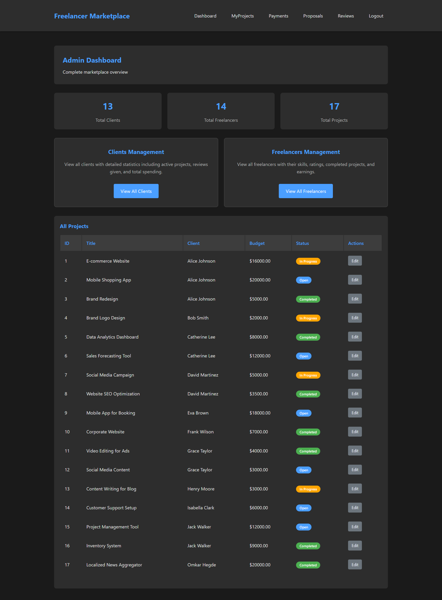

# Freelancer Marketplace

A comprehensive web-based platform connecting freelancers and clients for project management and collaboration. I developed this to learn how to work with database management systems in applications. Built with Flask, MySQL, and HTML, CSS, JS for the frontend.



## Features

### For Clients
- **Project Management**: Create, edit, and manage projects with detailed descriptions, budgets, and timelines
- **Proposal Review**: View and manage proposals from freelancers
- **Payment Processing**: Handle payments for completed projects
- **Review System**: Rate and review freelancers after project completion
- **Dashboard Analytics**: Track active projects, spending, and freelancer performance

### For Freelancers
- **Project Discovery**: Browse available projects and filter by requirements
- **Proposal Submission**: Submit detailed proposals with cover letters and expected payments
- **Skill Management**: Add, edit, and showcase professional skills with descriptions
- **Portfolio Tracking**: Monitor completed projects and earnings
- **Client Reviews**: Build reputation through client feedback and ratings

### For Administrators
- **User Management**: View and manage all clients and freelancers
- **System Analytics**: Comprehensive dashboard with marketplace statistics
- **Project Oversight**: Monitor all projects and their progress
- **Review Moderation**: Oversee the review and rating system

## How It Works

1. **Registration**: Users sign up as clients or freelancers through their unique IDs
2. **Project Creation**: Clients post projects with requirements, budgets, and timelines
3. **Proposal Process**: Freelancers browse and submit proposals for interesting projects
4. **Selection**: Clients review proposals and accept the best fit
5. **Project Execution**: Work is completed with status tracking throughout
6. **Payment & Review**: Upon completion, payments are processed and reviews are exchanged

## Technology Stack

- **Backend**: Flask 
- **Database**: MySQL with comprehensive stored procedures and triggers
- **Frontend**: HTML5, CSS3, JavaScript
- **Authentication**: Session-based authentication system

## Prerequisites

- Python 3.8 or higher
- MySQL Server 8.0 or higher
- pip

## ⚙️ Installation & Setup

### 1. Clone the Repository
```bash
git clone https://github.com/omkarh20/Freelancer-Client-Marketplace.git
cd Freelancer-Client-Marketplace
```

### 2. Install Dependencies
```bash
pip install -r requirements.txt
```

### 3. MySQL Database Setup
1. **Install MySQL Server**:
   - Download and install MySQL Server from [official website](https://dev.mysql.com/downloads/mysql/)
   - Start the MySQL service
   - Create a root user with password

2. **Create Database**:
   ```bash
   mysql -u root -p
   ```
   ```sql
   -- Run the SQL files in order:
   source sql/creation.sql
   source sql/insertion.sql
   source sql/queries.sql
   source sql/advanced.sql
   ```

### 4. Environment Configuration
Create a `.env` file in the root directory:
```env
SECRET_KEY=your-secret-key-here
ADMIN_PASSWORD=your-admin-password-here
DB_PASSWORD=your-db-password-here
```

### 5. Database Configuration
Update the database configuration in `app.py`:
```python
DB_CONFIG = {
    'host': 'localhost',
    'user': 'root',
    'password': os.getenv('DB_PASSWORD'),
    'database': 'Freelancer_Client_Marketplace'
}
```

### 6. Run the Application
```bash
python app.py
```

The application will be available at `http://localhost:5000`

## Login Credentials

### Admin Access
- **Role**: Admin
- **Password**: Use the password set in your `.env` file

### Client & Freelancer Access
- **Login Method**: Use your respective ID numbers
- **Client ID**: Any valid client_id from the database
- **Freelancer ID**: Any valid freelancer_id from the database

## Project Structure

```
├── .gitignore
├── README.md
├── app.py                      # Main Flask application
├── requirements.txt            # Python dependencies
├── sql/                        # Database files
│   ├── advanced.sql           # Advanced queries and procedures
│   ├── creation.sql           # Database schema
│   ├── insertion.sql          # Sample data
│   └── queries.sql            # Basic queries
├── static/                     # Static assets
│   ├── css/
│   │   └── style.css          # Main stylesheet
│   └── js/
│       └── script.js          # JavaScript functionality
└── templates/                  # HTML templates
    ├── add_client.html
    ├── add_freelancer.html
    ├── add_project.html
    ├── add_review.html
    ├── admin_clients.html
    ├── admin_freelancers.html
    ├── available_projects.html
    ├── base.html              # Base template
    ├── dashboard_admin.html
    ├── dashboard_client.html
    ├── dashboard_freelancer.html
    ├── edit_profile.html
    ├── edit_project.html
    ├── edit_proposal.html
    ├── login.html
    ├── manage_proposals.html
    ├── payments.html
    ├── projects.html
    ├── proposals.html
    ├── reviews.html
    └── submit_proposal.html
```

## Database Schema

The application uses a comprehensive MySQL database with the following key tables:
- **Client**: Client information and registration details
- **Freelancers**: Freelancer profiles and credentials
- **Projects**: Project details, budgets, and status tracking
- **Proposals**: Freelancer proposals for projects
- **Skills**: Skill definitions and categories
- **Freelancer_Skills**: Many-to-many relationship for freelancer skills
- **Reviews**: Client reviews and ratings for freelancers
- **Payments**: Payment processing and transaction records

## Future Enhancements

- Real-time chat system
- Email notification system
- File upload and document management
- Advanced analytics and reporting
- Mobile-responsive design improvements
- API development for mobile applications

---
